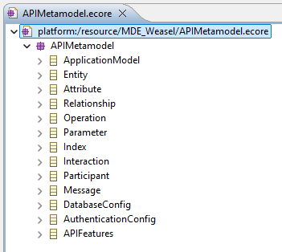
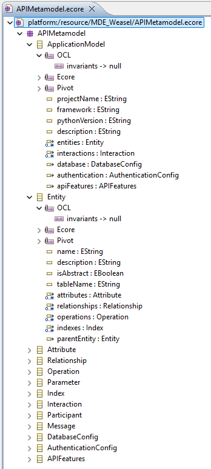

# KowihanSynapse: A Hybrid Model-Driven and AI-Powered Framework for REST API Generation


> A novel framework for accelerating robust REST API development by integrating a hybrid user interaction model with a sophisticated backend rooted in Model-Driven Engineering (MDE) and Artificial Intelligence (AI).

-----

## Table of Contents

1.  [Abstract](#1-abstract)
2.  [Introduction](#2-introduction)
3.  [System Architecture](#3-system-architecture)
    - [Architectural Layers](#31-architectural-layers)
    - [Data Flow](#32-data-flow)
4.  [Technology Stack](#4-technology-stack)
5.  [Installation](#5-installation)
6.  [Platform Demonstration](#6-platform-demonstration)

## 1\. Abstract

KowihanSynapse is a hybrid framework designed to modernize REST API development by combining model-driven engineering and artificial intelligence within a unified generation process. It offers two complementary modes of operation: an MDE-based approach that transforms UML models expressed in Papyrus XMI into production-ready code using Acceleo model-to-text templates, and an AI-driven approach that enables API generation through structured conversational interaction with specialized AI agents. The framework supports multiple backend technologies, including Django and Flask, and integrates seamlessly with various database management systems such as PostgreSQL, MySQL, SQLite, and Oracle, delivering deployment-ready backend code that follows established architectural and development best practices.


## 2\. Introduction

The proliferation of service-oriented architectures has positioned the *REST API* as a cornerstone of modern software development. However, the process of scaffolding these APIs—defining data models, creating serialization logic, writing boilerplate for *CRUD* (Create, Read, Update, Delete) operations, and ensuring security—is often a repetitive and error-prone task. This project posits that a synthesis of AI-driven natural language understanding and the formalisms of MDE can create a highly efficient generation pipeline. *KowihanSynapse* is an implementation of this thesis, providing a seamless workflow from high-level conceptualization to deployable code.

## 3\. System Architecture

The architecture of KowihanSynapse is designed as a modular, multi-layered system that separates concerns from user interaction to code generation. The data flows through a pipeline that progressively refines a high-level user request into a formal application model, which is then used as a single source of truth for code generation.

### 3.1 Architectural Layers
The proposed system architecture is organized into well-defined layers, each responsible for a specific set of functionalities. This layered design ensures modularity, scalability, and clear separation of concerns between user interaction, processing logic, model transformation, and code generation.

#### *Presentation Layer (Client-Side)*

This layer represents the user-facing interface of the system. It allows users to interact with the platform through UML model uploads or natural language input. The frontend is responsible for collecting user requirements, managing configurations, and displaying generated results. Communication with backend services is performed through RESTful APIs using JSON payloads.

#### *Application Layer (Server-Side)*

The application layer acts as the coordination hub of the system. It manages request routing, workflow orchestration, and service communication. This layer ensures that user inputs are correctly dispatched either to the MDE processing pipeline or to the AI-based generation services, while maintaining a unified interaction interface for the frontend.

#### *AI Processing Layer (Server-Side)*
This layer handles all artificial intelligence–related tasks. It processes natural language input, extracts domain entities and relationships, and infers system specifications using large language models.
#### *Model-Driven Engineering Layer (Server-Side)*
The Model-Driven Engineering layer is responsible for handling formal models and transformations. It validates UML models, applies metamodel constraints, and converts high-level system specifications into platform-independent models. This layer ensures consistency, correctness, and reusability through standardized modeling and transformation mechanisms.
#### *Code Generation Layer (Server-Side)*
This layer performs model-to-text transformations to produce executable backend source code. Based on the validated models, it applies predefined templates to generate framework-specific files, including data models, service layers, and configuration files.
#### *Persistence Layer (Server-Side)*
The persistence layer represents the data storage systems used by the generated backend applications. It supports multiple database management systems and abstracts data access through ORM mechanisms, ensuring portability and database independence.


### 3.2 Data Flow

The workflow can be summarized as follows:


## 4\. Technology Stack

The selection of technologies is based on robustness, scalability, and ecosystem maturity, primarily centered around Python and JavaScript.


  ###  Frontend
- **React 18** + TypeScript: Used to build a dynamic single-page user interface for UML modeling, AI interaction, and configuration workflows
- **Vite** (Build tool):Provides fast development server and optimized production builds for the frontend.
- **Tailwind CSS** (Styling): Enables responsive and consistent UI styling using utility-first CSS classes.
- **Lucide React** (Icons): Supplies lightweight SVG icons to enhance user experience and interface clarity.
- **Axios** (HTTP client): Handles HTTP communication between the frontend and backend REST APIs.

###  Backend Services

#### **Unified Flask API** (Port 5000)
- **Flask 2.3** + Flask-CORS: Acts as a centralized API gateway coordinating MDE and AI workflows.
- **lxml** (XMI parsing): Parses and validates UML models encoded in XMI format.
- **Requests** (Service orchestration): Manages synchronous HTTP calls between internal backend services.

#### **Spring Boot Service** (Port 8080)
- **Spring Boot 3.2**: Implements the core Model-Driven Engineering service with RESTful endpoints.
- **Jackson** (JSON processing): Serializes and deserializes JSON data exchanged between services.
- **Maven** (Build tool):Manages project dependencies and builds the Spring Boot service.

#### **AI Service** (Port 7000)
- **Flask** (REST API): Exposes REST APIs for AI-based processing and orchestration.
- **Ollama** (LLM integration): Runs and manages local large language models for code-related reasoning.
- **Llama 3.2** (Language model): Performs natural language understanding and specification extraction.

###  Model-Driven Engineering
- **Eclipse EMF** (Ecore models): Defines metamodels and processes UML models for model transformation.
- **Acceleo 3.7** (M2T transformation): Generates backend source code by transforming EMF models into textual artifacts using templates.
- **Papyrus** (UML modeling): Provides a UML modeling environment to design system models compliant with EMF standards.
- **XMI 2.5** (Model interchange): Acts as the standardized XML-based format for exchanging UML models between tools and services.

###  Generated Frameworks
- **Django 4.2** + Django REST Framework
- **Flask 2.3** + Flask-SQLAlchemy 
## 5\. Installation


### Prerequisites
- **Node.js** 18+
- **Python** 3.9+
- **Java** 17+
- **Maven** 3.8+
- **Eclipse** 2023-12 (with Acceleo & Papyrus plugins)
- **Ollama** (for AI mode)

### 1. Clone Repository
```bash
git clone https://github.com/m-elhamlaoui/mde-project-kowihansynapse.git
cd KowihanProject
```

### 2. Install Ollama (for AI Mode)
```bash
# Install Ollama
curl -fsSL https://ollama.ai/install.sh | sh

# Pull Llama model
ollama pull llama3.2
```

### 3. Setup Backend Services

#### Unified Flask Backend (Port 5000)
```bash
cd KowihanBackend
python3 -m venv venv
source venv/bin/activate
pip install -r requirements.txt
python app.py
```

#### Spring Boot Service (Port 8080)
```bash
cd KowihanBackend/spring-boot-acceleo
mvn clean install
mvn spring-boot:run
```

#### AI Service (Port 7000)
```bash
cd KowihanBackend/api_generator_platform_using_IA
python3 -m venv env
source env/bin/activate
pip install -r requirements.txt
python app.py
```

### 4. Setup Frontend
```bash
cd KowihanFrontend/project
npm install
npm run dev
# Access: http://localhost:5173
```
## 6\. Platform Demonstration

KowihanSynapse offers two complementary approaches for REST API development, each addressing specific needs in terms of architectural rigor and implementation speed.


### 6.1 Model-Driven Engineering (MDE) Approach

This methodology relies on a formal process of transforming UML models into operational source code, ensuring a robust architecture compliant with software engineering standards.

#### API Metamodel (Ecore)

The MDE approach is grounded in a formal metamodel defined in Ecore (Eclipse Modeling Framework). This metamodel establishes the structural and semantic constraints that govern the generation process, ensuring consistency and correctness of the generated REST APIs.

**Metamodel Structure:**

The `APIMetamodel.ecore` defines the following core concepts:

- **ApplicationModel**: The root element representing the complete API specification
  - Project metadata (name, framework, Python version, description)
  - Collections of entities, interactions, database configuration, and authentication settings
  - OCL constraints ensuring valid Python versions (3.7-3.12), framework selection (DJANGO, FLASK, FASTAPI), and proper project naming

- **Entity**: Represents business domain objects mapped to database tables
  - Attributes defining data fields with type constraints
  - Relationships with other entities (ONE_TO_ONE, ONE_TO_MANY, MANY_TO_ONE, MANY_TO_MANY)
  - Operations and indexes for performance optimization
  - Validation rules for entity names, table names, and attribute uniqueness

- **Attribute**: Defines entity properties with rich metadata
  - Supported data types: STRING, TEXT, INTEGER, FLOAT, DECIMAL, BOOLEAN, DATE, DATETIME, TIME, UUID, EMAIL, URL, JSON
  - Constraints: primary key, nullable, unique, default values, length limits
  - Validation ensuring primary keys are non-nullable and string lengths do not exceed 5000 characters

- **Relationship**: Models associations between entities
  - Cardinality types with cascade behavior (CASCADE, SET_NULL, PROTECT)
  - Bidirectional relationship support with related names

- **Interaction**: Represents API endpoints derived from sequence diagrams
  - HTTP methods: GET, POST, PUT, PATCH, DELETE
  - Endpoint URL patterns with validation
  - Participants (actors, entities, systems) and message sequences

- **DatabaseConfig**: Specifies database connection parameters
  - Supported systems: POSTGRESQL, MYSQL, SQLITE, ORACLE
  - Host, port, and database name with validation constraints

- **AuthenticationConfig**: Defines API security mechanisms
  - Methods: JWT, SESSION, OAUTH2, BASIC
  - Token expiry configuration (5-10080 minutes)

- **APIFeatures**: Controls optional API capabilities
  - Pagination, filtering, Swagger/OpenAPI documentation, CORS support

**Visual Representation:**



*Figure 1: Complete API Metamodel hierarchy showing all classes and their relationships*



*Figure 2: Detailed view of metamodel classes with attributes, constraints, and structural features*

#### Step 1: UML Class Diagram Import

The process begins with importing the application's structural model.

- **Action**: Upload files in .xmi, .uml, or .xml format, generated from recognized modeling tools (Papyrus, Eclipse UML)
- **Objective**: Formal definition of business entities, their attributes, and inter-entity relationships forming the API's architectural foundation


#### Step 2: Sequence Diagram Import (Optional)

This step enriches the model with custom behavioral logic.

- **Action**: Import sequence diagrams specifying complex interactions and business logic
- **Alternative mechanism**: In the absence of sequence diagrams, the system automatically generates complete CRUD operations for all detected entities


#### Step 3: Project Configuration

Configuration of the technology stack according to project requirements.

- **Framework**: Selection of Python framework (Django or Flask) based on the targeted architecture
- **Database**: Configuration of the database management system (PostgreSQL, MySQL, SQLite, Oracle) with connection and authentication parameters
- **Advanced features**: Optional activation of pagination, filtering, Swagger/OpenAPI documentation, and CORS header management


#### Step 4: Review & Generation

Quality control phase preceding model transformation.

- **Verification**: Synthetic review of configuration (project metadata, UML models, database parameters)
- **Execution**: Launch of the Acceleo transformation engine for automatic source code generation


#### Step 5: Artifact Download

Retrieval of the final deliverable ready for deployment.

- **Deliverable**: Structured ZIP archive containing the complete API source code
- **Deployment status**: Pre-configured application, ready for execution in local or remote environments


### 6.2 AI-Powered Generation Approach

This approach leverages AI techniques to translate natural language specifications into functional backend architectures.

#### Step 1: Objective Definition

Formalization of requirements in accessible terms.

- **Action**: Enter a textual description of the project (example: "Library management API with books, authors, and loans")
- **Assistance**: Predefined suggestions to accelerate specification of common use cases (e-commerce, management systems, content platforms)


#### Step 2: Database Management System Selection

Choice of storage engine adapted to performance requirements.

- **Available options**: PostgreSQL (complex queries, ACID compliance), MySQL (web applications), SQLite (lightweight solutions), Oracle (enterprise environments)
- **Decision support**: Technical indicators on the characteristics of each solution


#### Step 3: Framework Selection

Choice of Python backend technology.

- **Django**: Comprehensive framework preferred for feature-rich applications, with a "batteries included" approach
- **Flask**: Minimalist framework recommended for microservices and modular prototypes


#### Step 4: Data Model Definition

Data structure specification via simplified syntax.

- **Action**: Enumeration of entities and their attributes (example: Book: title, isbn | Author: name, biography)
- **Intelligent detection**: Automatic recognition of relationships between entities for constructing a coherent relational schema


#### Step 5: AI Synthesis

Final source code generation.

- **Verification**: Validation of specification (objective, database, framework)
- **Generation**: Activation of the multi-agent system for automatic synthesis of backend architecture, database migrations, and API endpoints


**Additional resource**: A complete demonstration video is available at the following link: 
[https://www.canva.com/design/DAG-4RQtPxw/7cxjXSL0rElS4SuPahMNcA/watch?utm_content=DAG-4RQtPxw&utm_campaign=designshare&utm_medium=link2&utm_source=uniquelinks&utlId=hebd6ca075c](https://www.canva.com/design/DAG-9BFmGzI/FqkG56EhR7SsaLlv3iaWmw/edit?utm_content=DAG-9BFmGzI&utm_campaign=designshare&utm_medium=link2&utm_source=sharebutton)
