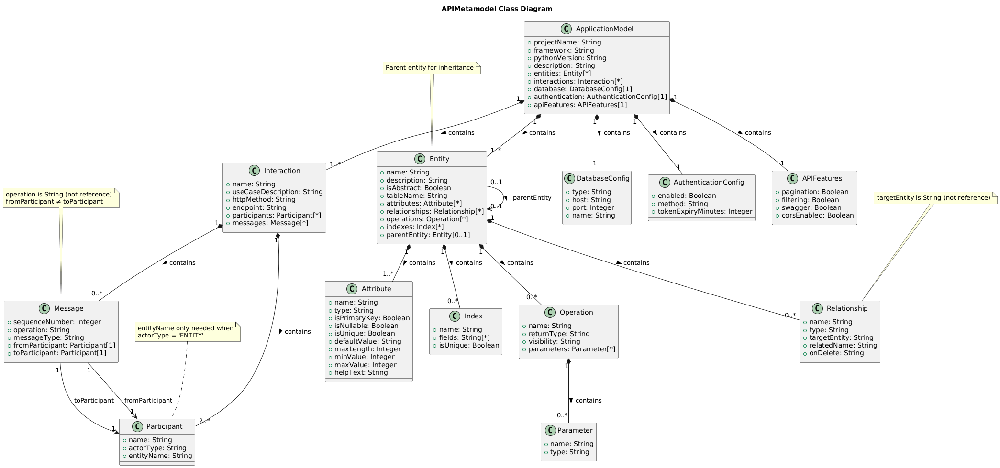
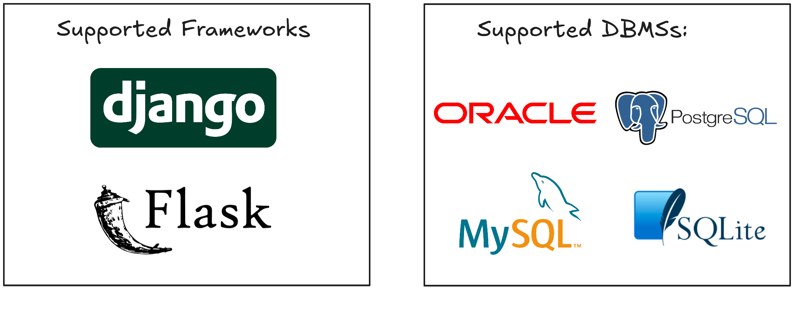

# KowihanSynapse: A Hybrid Model-Driven and AI-Powered Framework for REST API Generation


> A novel framework for accelerating robust REST API development by integrating a hybrid user interaction model with a sophisticated backend rooted in Model-Driven Engineering (MDE) and Artificial Intelligence (AI).

-----

## Table of Contents

1.  [Abstract](#1-abstract)
2.  [Introduction](#2-introduction)
3.  [System Architecture](#3-system-architecture)
    - [Architectural Layers](#31-architectural-layers)
    - [Data Flow](#32-data-flow)
4.  [API Metamodel (Ecore)](#4-api-metamodel-ecore)
5.  [Technology Stack](#5-technology-stack)
6.  [Comparative Analysis: MDE vs AI Through 3 Use Cases](#6-comparative-Analysis)
7.  [Installation](#7-installation)
8.  [Platform Demonstration](#8-platform-demonstration)

## 1\. Abstract

KowihanSynapse is a hybrid framework designed to modernize REST API development by combining model-driven engineering and artificial intelligence within a unified generation process. It offers two complementary modes of operation: an MDE-based approach that transforms UML models expressed in Papyrus XMI into production-ready code using Acceleo model-to-text templates, and an AI-driven approach that enables API generation through structured conversational interaction with specialized AI agents. The framework supports multiple backend technologies, including Django and Flask, and integrates seamlessly with various database management systems such as PostgreSQL, MySQL, SQLite, and Oracle, delivering deployment-ready backend code that follows established architectural and development best practices.


## 2\. Introduction

The proliferation of service-oriented architectures has positioned the *REST API* as a cornerstone of modern software development. However, the process of scaffolding these APIs—defining data models, creating serialization logic, writing boilerplate for *CRUD* (Create, Read, Update, Delete) operations, and ensuring security—is often a repetitive and error-prone task. This project posits that a synthesis of AI-driven natural language understanding and the formalisms of MDE can create a highly efficient generation pipeline. *KowihanSynapse* is an implementation of this thesis, providing a seamless workflow from high-level conceptualization to deployable code.

## 3\. System Architecture

The architecture of KowihanSynapse is designed as a modular, multi-layered system that separates concerns from user interaction to code generation. The data flows through a pipeline that progressively refines a high-level user request into a formal application model, which is then used as a single source of truth for code generation.


### 3.1 Architectural Layers
The proposed system architecture is organized into well-defined layers, each responsible for a specific set of functionalities. This layered design ensures modularity, scalability, and clear separation of concerns between user interaction, processing logic, model transformation, and code generation.

#### *Presentation Layer (Client-Side)*

This layer represents the user-facing interface of the system. It allows users to interact with the platform through UML model uploads or natural language input. The frontend is responsible for collecting user requirements, managing configurations, and displaying generated results. Communication with backend services is performed through RESTful APIs using JSON payloads.

#### *Application Layer (Server-Side)*

The application layer acts as the coordination hub of the system. It manages request routing, workflow orchestration, and service communication. This layer ensures that user inputs are correctly dispatched either to the MDE processing pipeline or to the AI-based generation services, while maintaining a unified interaction interface for the frontend.

#### *AI Processing Layer (Server-Side)*
This layer handles all artificial intelligence–related tasks. It processes natural language input, extracts domain entities and relationships, and infers system specifications using large language models.
The AI Processing Layer employs a **multi-agent architecture** where specialized AI agents collaborate to analyze, enhance, and validate project specifications. The system leverages local LLMs (Llama via Ollama) for intelligent recommendations without external dependencies.
##### Agent Workflow

**1. Agent Orchestrator**  
*Central coordinator managing the multi-agent pipeline.*

**Process:**
1. Receives project specifications (objective, framework, database, entities)
2. Routes analysis tasks to specialized agents in optimal sequence
3. Aggregates insights from all agents
4. Returns enhanced specifications to code generator

**Output:** Unified report containing domain analysis, security assessment, best practices, and documentation.


**2. Specification Analyzer**  
*Analyzes project objective to understand domain and complexity.*

**Input:** Natural language project description

**Tasks:**
- Detects application domain (e-commerce, blog, social network, etc.)
- Estimates complexity level (low/medium/high)
- Suggests core entities for the detected domain
- Recommends appropriate technology stack

**Output:**
- Domain classification with confidence
- Complexity assessment
- Recommended entity structure
- Tech stack suggestions (framework, database, caching)

**Example:** For "blog platform", suggests User, Post, Comment, Category entities.


**3. Entity Enricher**  
*Enhances entities with intelligent attribute and relationship suggestions.*

**Input:** Entity name + current attributes

**Tasks:**
- Identifies missing standard fields (e.g., User needs avatar, bio, is_active)
- Suggests appropriate data types for attributes
- Detects missing foreign keys and relationships
- Recommends SEO/UX fields (slugs, status, published_at)

**Output:**
- Suggested attributes with types and justifications
- Missing relationship recommendations
- Data validation hints
- Index optimization suggestions

**Example:** For "Post" entity, suggests slug (SEO), view_count (analytics), featured (boolean).


**4. Code Optimizer**  
*Provides best practices and optimization recommendations.*

**Input:** Project specifications + framework choice

**Tasks:**
- Suggests framework-specific conventions (Django/Flask patterns)
- Recommends performance optimizations (indexing, caching, query optimization)
- Proposes design patterns and validation strategies
- Advises on API design (RESTful patterns, versioning, documentation)

**Output:**
- Top 10 actionable best practices
- Code structure recommendations
- Performance optimization tips
- Testing strategy guidance

**Example:** "Use select_related() to avoid N+1 queries", "Implement rate limiting on auth endpoints".


**5. Security Auditor**  
*Performs comprehensive security analysis.*

**Input:** Complete project specifications

**Tasks:**
- Validates JWT implementation and password hashing
- Reviews authorization and permission classes
- Checks CORS, CSRF, and input validation
- Audits secret management and HTTPS configuration
- Maps to OWASP vulnerabilities

**Output:**
- Security score (A+ to F)
- Critical warnings requiring immediate attention
- Recommended security enhancements
- Compliance checklist

**Example:** "Security Score: B+ | Warning: Set DEBUG=False in production | Enable HTTPS redirect".


**6. Documentation Generator**  
*Creates comprehensive project documentation.*

**Input:** Complete specifications + agent insights

**Tasks:**
- Generates quick start installation guide
- Creates API reference with examples
- Documents system architecture and data flow
- Produces deployment guide with Docker config

**Output:**
- Multi-section markdown documentation
- Code examples and curl commands
- Architecture diagrams (ASCII art)
- Production deployment checklist


#### *Model-Driven Engineering Layer (Server-Side)*
The Model-Driven Engineering layer is responsible for handling formal models and transformations. It validates UML models, applies metamodel constraints, and converts high-level system specifications into platform-independent models. This layer ensures consistency, correctness, and reusability through standardized modeling and transformation mechanisms.
#### *Code Generation Layer (Server-Side)*
This layer performs model-to-text transformations to produce executable backend source code. Based on the validated models, it applies predefined templates to generate framework-specific files, including data models, service layers, and configuration files.
#### *Persistence Layer (Server-Side)*
The persistence layer represents the data storage systems used by the generated backend applications. It supports multiple database management systems and abstracts data access through ORM mechanisms, ensuring portability and database independence.


### 3.2 Data Flow

The workflow can be summarized as follows:


## 4\. API Metamodel (Ecore)

The MDE approach in KowihanSynapse is grounded in a formal metamodel defined in Ecore (Eclipse Modeling Framework). This metamodel establishes the structural and semantic constraints that govern the generation process, ensuring consistency and correctness of the generated REST APIs.

### 4.1 Metamodel Structure



*The class diagram above illustrates the complete structure of the API metamodel, showing the relationships between ApplicationModel, Entity, Attribute, Relationship, Interaction, DatabaseConfig, AuthenticationConfig, and APIFeatures. Each entity is defined with its attributes, operations, and OCL constraints that ensure model validity and generation correctness.*

The `APIMetamodel.ecore` defines the following core concepts:

- **ApplicationModel**: The root element representing the complete API specification
  - Project metadata (name, framework, Python version, description)
  - Collections of entities, interactions, database configuration, and authentication settings
  - OCL constraints ensuring valid Python versions (3.7-3.12), framework selection (DJANGO, FLASK, FASTAPI), and proper project naming

- **Entity**: Represents business domain objects mapped to database tables
  - Attributes defining data fields with type constraints
  - Relationships with other entities (ONE_TO_ONE, ONE_TO_MANY, MANY_TO_ONE, MANY_TO_MANY)
  - Operations and indexes for performance optimization
  - Validation rules for entity names, table names, and attribute uniqueness

- **Attribute**: Defines entity properties with rich metadata
  - Supported data types: STRING, TEXT, INTEGER, FLOAT, DECIMAL, BOOLEAN, DATE, DATETIME, TIME, UUID, EMAIL, URL, JSON
  - Constraints: primary key, nullable, unique, default values, length limits
  - Validation ensuring primary keys are non-nullable and string lengths do not exceed 5000 characters

- **Relationship**: Models associations between entities
  - Cardinality types with cascade behavior (CASCADE, SET_NULL, PROTECT)
  - Bidirectional relationship support with related names

- **Interaction**: Represents API endpoints derived from sequence diagrams
  - HTTP methods: GET, POST, PUT, PATCH, DELETE
  - Endpoint URL patterns with validation
  - Participants (actors, entities, systems) and message sequences

- **DatabaseConfig**: Specifies database connection parameters
  - Supported systems: POSTGRESQL, MYSQL, SQLITE, ORACLE
  - Host, port, and database name with validation constraints

- **AuthenticationConfig**: Defines API security mechanisms
  - Methods: JWT, SESSION, OAUTH2, BASIC
  - Token expiry configuration (5-10080 minutes)

- **APIFeatures**: Controls optional API capabilities
  - Pagination, filtering, Swagger/OpenAPI documentation, CORS support

### 4.2 Visual Representations


*Figure 1: Complete API Metamodel hierarchy showing all classes and their relationships*


*Figure 2: Detailed view of metamodel classes with attributes, constraints, and structural features*

## 5\. Technology Stack

The selection of technologies is based on robustness, scalability, and ecosystem maturity, primarily centered around Python and JavaScript.

###  Frontend
- **React 18** + TypeScript: Used to build a dynamic single-page user interface for UML modeling, AI interaction, and configuration workflows
- **Vite** (Build tool):Provides fast development server and optimized production builds for the frontend.
- **Tailwind CSS** (Styling): Enables responsive and consistent UI styling using utility-first CSS classes.
- **Lucide React** (Icons): Supplies lightweight SVG icons to enhance user experience and interface clarity.
- **Axios** (HTTP client): Handles HTTP communication between the frontend and backend REST APIs.

###  Backend Services

#### **Unified Flask API** (Port 5000)
- **Flask 2.3** + Flask-CORS: Acts as a centralized API gateway coordinating MDE and AI workflows.
- **lxml** (XMI parsing): Parses and validates UML models encoded in XMI format.
- **Requests** (Service orchestration): Manages synchronous HTTP calls between internal backend services.

#### **Spring Boot Service** (Port 8080)
- **Spring Boot 3.2**: Implements the core Model-Driven Engineering service with RESTful endpoints.
- **Jackson** (JSON processing): Serializes and deserializes JSON data exchanged between services.
- **Maven** (Build tool):Manages project dependencies and builds the Spring Boot service.

#### **AI Service** (Port 7000)
- **Flask** (REST API): Exposes REST APIs for AI-based processing and orchestration.
- **Ollama** (LLM integration): Runs and manages local large language models for code-related reasoning.
- **Llama 3.2** (Language model): Performs natural language understanding and specification extraction.

###  Model-Driven Engineering
- **Eclipse EMF** (Ecore models): Defines metamodels and processes UML models for model transformation.
- **Acceleo 3.7** (M2T transformation): Generates backend source code by transforming EMF models into textual artifacts using templates.
- **Papyrus** (UML modeling): Provides a UML modeling environment to design system models compliant with EMF standards.
- **XMI 2.5** (Model interchange): Acts as the standardized XML-based format for exchanging UML models between tools and services.

###  Generated Frameworks
- **Django 4.2** + Django REST Framework
- **Flask 2.3** + Flask-SQLAlchemy



## 6\. Comparative Analysis: MDE vs AI Through 3 Use Cases
This section evaluates both KowihanSynapse approaches through three representative scenarios, analyzing architectural rigor, ease of modification, and suitability of each method.
### 6.1 Use Case 1: Multi-Vendor E-Commerce Platform

#### **Project Context**

**Business Requirements:**
- Complex system with 12+ interconnected entities (User, Vendor, Product, Order, Payment, Shipping, Review, etc.)
- Sophisticated business rules: inventory validation, vendor commission calculation, promotion management
- Custom workflows: bulk order processing, analytics reports, inventory reconciliation
- Regulatory constraints: GDPR compliance, financial transaction traceability

**Technical Complexity:**
- 25+ business validation rules
- Custom endpoints requiring sequence diagrams
- State machines for order status transitions
- External integrations (payment gateways, shipping APIs)
#### **MDE Approach**

**Implementation Process:**
1. Complete UML modeling in Papyrus (class + sequence diagrams)
2. Generation via Acceleo

**What is Generated:**
- **Complete CRUD** for all 12 entities with optimized relationships
- **Method prototypes** for workflows defined in sequence diagrams (order processing, commission calculation)
- **Automatic validators** based on OCL constraints
- **Base structure** for custom endpoints with method signatures

**What Remains to Implement Manually:**
- **Method bodies** from sequence diagrams (~40% of business logic)
- **External integrations** (payment, shipping APIs)
- **Complex calculation logic** (commissions, dynamic promotions)

**Evaluation:**

**Architectural Rigor: 5/5**
- Constraints translated into automatic validators preventing invalid states
- Formalized database relationships 
- Clear architecture: domain/application/data separation
- Method signatures ensure consistent interface contracts

**Ease of Modification: 2/5**
- **Strengths**: Structural changes (add entity, modify relationships) propagate automatically
- **Strengths**: Constraints modifiable visually, systematic validator regeneration
- **Limitations**: 10-15 minute iteration cycle (model modification → validation → regeneration)
- **Limitations**: Requires UML/Papyrus expertise for modifications


**Maintainability: 5/5**
- UML models = living documentation always synchronized
- Controlled evolution: constraint modification updates all validation
- Method prototypes clarify what needs manual implementation
- XMI versioning enables precise architectural evolution traceability

**Manual Code Required: ~35-40%**
- Implementation of sequence diagram method bodies
- Complex business logic not expressible in diagrams
- External system integrations

**Why MDE Excels Here:**
- **Formal constraints**: OCL prevents invalid states at model level 
- **Guaranteed architecture**: Robust base structure with all validators and relationships
- **Clear prototypes**: Method signatures from diagrams guide remaining implementation
- **Team coordination**: Backend developers know exactly what to implement from prototypes
- **Controlled evolution**: Structural modifications propagated automatically

**Verdict:  MDE Strongly Recommended**


#### **AI Approach**

**Implementation Process:**
1. Textual description: "Multi-vendor marketplace with products, orders, payments"
2. Entity specification: `User, Vendor, Product, Order, Payment...`
3. Generation in 5-10 minutes via AI agents

**What is Generated:**
- **Standard CRUD** for all entities
- **Basic relationships** between entities (automatic detection)
- **Simple validations** (email formats, minimum lengths)
- **Intelligent suggestions** (missing fields, recommended indexes)

**What Remains to Implement Manually:**
- **All custom workflows** (order processing, analytics)
- **All complex business rules** (commission calculations, promotions)
- **All advanced validations**
- **All external integrations**

**Evaluation:**

**Architectural Rigor: 3/5**
- Well-structured code following Django/Flask conventions
- **Missing**: No formal constraints; basic validations only
- Simplified relationships (generic CASCADE instead of business strategies)

**Ease of Modification: 4/5**
- Direct Python code editing without specialized tools
- Fast iteration for small changes
- Requires 60-70% manual coding for advanced features

**Maintainability: 2/5**
- Standard CRUD generated, but custom workflows absent
- Technical debt risk: numerous undocumented manual additions
- No clear separation between generated and manual code

**Manual Code Required: ~60-70%**
- All endpoints beyond CRUD
- All complex business logic
- Advanced validations and consistency rules

**Critical Limitations:**
-  No custom endpoints (bulk processing, vendor analytics)
- Absence of complex business rule validation
-  No structural guidance for what needs to be added
-  Commission logic, shipping calculations: completely manual implementation

**Verdict:  AI Inadequate - Too much manual development for this complexity level**

### 6.2 Use Case 2: Personal Blog (MVP)

#### **Project Context**

**Business Requirements:**
- 4 simple entities: User, Post, Comment, Tag
- Standard CRUD with search and filtering
- Basic social features (likes, nested comments)


**Technical Complexity:**
- No complex business rules beyond basic validations
- All operations are standard REST patterns
- No custom workflows requiring sequence diagrams


#### **MDE Approach**

**What is Generated:**
- Complete CRUD for 4 entities
- Optimized relationships (Post → User, Comment → Post)
- Basic validations via OCL constraints

**Evaluation:**

**Architectural Rigor: 4/5**
- Clean, well-structured Django application
- Formal architecture may be excessive for simplicity

**Ease of Modification: 2/5**
- **Overhead**: 30 min UML modeling 
- Simple changes (add "featured" field) require complete cycle: open Papyrus → modify → regenerate
- **Barrier**: Solo developer without formal UML training
- Adding simple feature: full Eclipse environment required

**Maintainability: 4/5**
- Excellent for UML teams; excessive for simple project
- Formal documentation may be disproportionate

**Manual Code Required: ~5-10%**
- Almost everything generated as only CRUD needed
- Minor adjustments (templates, specific configurations)

**Why MDE is Suboptimal:**
- Disproportionate time investment: 30min+ to generate what basic CRUD already does
- No complex rules to formalize (OCL constraints useless for this case)
- No custom workflows → sequence diagrams unused
- Hampers rapid iteration needed for MVP phase

**Verdict:  MDE = Overkill for this case**


#### **AI Approach**

**Process:**
1. Description (30s): "Blog with posts, comments, tags, user authentication"
2. Entity specification (1 min)
3. Generation (5 min)

**What is Generated:**
- Complete CRUD with automatic relationships
- Intelligent fields suggested by Entity Enricher
- Security recommendations and best practices

**Evaluation:**

**Architectural Rigor: 4/5**
- Django code following best practices
- Slightly less formal than MDE but totally adequate

**Ease of Modification: 5/5**
- **Direct editing**: Adding field = simple modification in models.py
- **No tool dependency**: VS Code / PyCharm sufficient
- **Ultra-fast iteration**: Change → migrate → test in 30 seconds
- Low learning curve: junior Django developers contribute immediately

**Maintainability: 3/5**
- Good initial structure; subsequent changes = manual code editing
- Generated documentation helps onboarding
- Sufficient for project of this size

**Manual Code Required: ~10-15%**
- Some template adjustments
- Minor UI customizations
- Deployment configuration

**AI Value-Add:**
- **Entity Enricher** automatically adds:
  - `published_at` (publication timestamp)
  - `view_count` (analytics)
  - `featured` (highlight flag)
  - `User.bio`, `User.avatar` (author profiles)
- **Security Auditor** recommends: JWT authentication, rate limiting, XSS protection
- **Documentation Generator**: README with curl examples, deployment guide
- **Intelligent suggestions** enhance API without manual effort

**Why AI Excels Here:**
- **Speed**: Functional API in 5 minutes vs 30min+ for MDE
- **Automatic suggestions** add features beginners wouldn't think of
- **Perfect for validation**: Test concept quickly without heavy investment
- **Accessible interface**: Natural language, no UML learning curve
- **Just enough rigor**: Clean code without over-engineering

**Verdict:  AI Optimal for fast, simple API**
### 6.3 Use Case 3: Library Management System

#### **Project Context**

**Business Requirements:**
- Management of books, authors, members, loans, reservations
- Clear business rules: loan duration (14 days), member limit (5 books), late fees
- Status management: Book (Available, Borrowed, Reserved, Maintenance), Loan (Active, Returned, Overdue)
- Simple reports: popular books, active members, loan statistics

**Technical Complexity:**
- 6 entities with well-defined relationships
- Medium validation rules: availability checking, overdue detection
- No complex external integrations
- Few custom endpoints: advanced search, loan renewal, report generation

---

#### **MDE Approach**

**Implementation Process:**
1. Class diagram: Book, Author, Member, Loan, Reservation, Category
2. Constraints: "Member cannot borrow if 5 books already borrowed", "Book cannot be borrowed if reserved by another member"
3. Sequence diagrams (optional): Loan workflow (availability check → create loan → update book status)

**What is Generated:**
- **Complete CRUD** for 6 entities
- **Method prototypes** if sequence diagrams provided (renewal, advanced search)
- **Optimized relationships** with indexes on frequently searched fields

**What Remains to Implement:**
- **Late fee calculation** (specific business formula)
- **Method bodies** for advanced search and reports
- **Notifications** (return reminders, fees)

**Evaluation:**

**Architectural Rigor: 5/5**
- Constraints prevent business rule violations (borrowing unavailable book impossible)
- Clear separation of responsibilities


**Ease of Modification: 3/5**
- **Strengths**: Modify rule (limit 5→7 books) = change constraint → validator regeneration
- **Strengths**: Add new book status = modify enum in UML model
- **Limitations**: Requires Papyrus for structural modifications
- **Limitations**: Add custom report = create sequence diagram + implement method body

**Maintainability: ★★★★★**
- Business rules formally documented in OCL constraints
- Clear evolution: new rule → add constraint → automatic validation
- Librarians can understand rules via UML visualization

**Manual Code Required: ~20-25%**
- Implementation of calculations (fees, statistics)
- Advanced search method bodies
- Notification logic

**Why MDE is Relevant Here:**
- **Formalizable rules**: Business constraints (limits, availability) perfectly express in OCL
- **Predictable evolution**: Library rules change (loan periods, limits) → model modification propagates changes
- **Critical validations**: Preventing invalid loans at model level eliminates bugs
- **Living documentation**: Library managers understand UML as rule reference

**Verdict:  MDE Suitable - Clear rules benefit from formalization**


#### **AI Approach**

**Process:**
1. Description: "Library management system with books, authors, members, loans"
2. Specification: `Book, Author, Member, Loan, Reservation, Category`
3. Generation (3-5 min)

**What is Generated:**
- Complete CRUD for all entities
- Basic relationships automatically detected
- Intelligent suggested fields (Book.isbn, Member.member_id, Loan.due_date)

**What Remains to Implement:**
- **All business rules** (5 book limit, availability check)
- **All custom endpoints** (advanced search, renewal)
- **Calculations** (fees, statistics)
- **Status logic** and transitions

**Evaluation:**

**Architectural Rigor: 3/5**
- Correct base structure
- **Missing**: No business rule validation (member can borrow 50 books)
- **Missing**: No formal status and transition management

**Ease of Modification: 4/5**
- Direct Python editing for additions
- Fast iteration for prototyping
- But requires discipline to maintain rule consistency

**Maintainability: 3/5**
- Manually implemented business rules scattered in code
- No formal constraint documentation
- Risk of inconsistencies with multiple developers

**Manual Code Required: ~45-50%**
- All business validations
- Custom endpoints
- Status and transition management
- Calculations and reports

**Limitations:**
-  Business validations absent → easy to introduce bugs (borrow already borrowed book)
-  No guidance on rules to implement
-  Status not formalized → error-prone manual management
-  Functional for prototype but needs reinforcement before production

**Verdict:  AI Usable but requires 50% rigorous manual development**


### 6.4 Comparative Synthesis Table

| Criterion | E-Commerce (Case 1) | Blog MVP (Case 2) | Library (Case 3) |
|-----------|-------------------|------------------|------------------|
| **Complexity** | High (12+ entities, complex workflows) | Low (4 entities, standard CRUD) | Medium (6 entities, clear rules) |
| **Recommended Approach** |  **MDE** |  **AI** |  **MDE** |
| **Initial Development Time** | MDE: 3h / AI: 5min | MDE: 1h / AI: 5min | MDE: 2h / AI: 5min |
| **Architectural Rigor** | MDE: 5/5 / AI: 3/5| MDE: 4/5 / AI: 4/5 | MDE: 5/5 / AI: 3/5 |
| **Ease of Modification** | MDE: 3/5 / AI: 4/5 | MDE: 2/5 / AI: 5/5 | MDE: 3/5 / AI: 4/5 |
| **Long-term Maintainability** | MDE: 3/5 / AI: 2/5 | MDE: 4/5 / AI: 3/5 | MDE: 5/5 / AI: 3/5 |
| **Complete Generated Code** | MDE: 60-65% / AI: 30-40% | MDE: 90-95% / AI: 85-90% | MDE: 75-80% / AI: 50-55% |
| **Manual Code Required** | MDE: 35-40% / AI: 60-70% | MDE: 5-10% / AI: 10-15% | MDE: 20-25% / AI: 45-50% |
| **Formalized Business Rules** | MDE: Yes (OCL) / AI: No | N/A | MDE: Yes (OCL) / AI: No |
| **Custom Workflows** | MDE: Prototypes / AI: Absent | N/A | MDE: Prototypes / AI: Absent |

#### **Choose MDE When:**
- Project with **formalizable business rules** (constraints, validations, limits)
- Need for **custom workflows** beyond standard CRUD
-  **6+ interdependent entities** with complex relationships
- Team with **UML expertise** or willingness to invest in training
-  Value of **automatic validation** of business constraints

#### **Choose AI When:**
-  **MVP/prototype** requiring fast market validation (<1 week)
-  **Simple project** (≤5 entities, CRUD largely sufficient)
- Team **without UML training** or solo developer
-  **Tight timeline** (days, not weeks)
-  **Frequent iterations** in exploratory phase
- **No complex business rules** requiring formalization
-  Need for **intelligent suggestions** to enrich basic model

#### **Recommended Hybrid Approach:**
- **Phase 1 (Exploration - AI)**: Ultra-fast concept validation with AI
- **Phase 2 (Consolidation - MDE)**: If concept validated and rules become complex, migration to MDE
- **Maintenance**: MDE ensures controlled evolution with automatic change propagation


## 7\. Installation


### Prerequisites
- **Node.js** 18+
- **Python** 3.9+
- **Java** 17+
- **Maven** 3.8+
- **Eclipse** 2023-12 (with Acceleo & Papyrus plugins)
- **Ollama** (for AI mode)

### 1. Clone Repository
```bash
git clone https://github.com/m-elhamlaoui/mde-project-kowihansynapse.git
cd KowihanProject
```

### 2. Install Ollama (for AI Mode)
```bash
# Install Ollama
curl -fsSL https://ollama.ai/install.sh | sh

# Pull Llama model
ollama pull llama3.2
```

### 3. Setup Backend Services

#### Unified Flask Backend (Port 5000)
```bash
cd KowihanBackend
python3 -m venv venv
source venv/bin/activate
pip install -r requirements.txt
python app.py
```

#### Spring Boot Service (Port 8080)
```bash
cd KowihanBackend/spring-boot-acceleo
mvn clean install
mvn spring-boot:run
```

#### AI Service (Port 7000)
```bash
cd KowihanBackend/api_generator_platform_using_IA
python3 -m venv env
source env/bin/activate
pip install -r requirements.txt
python app.py
```

### 4. Setup Frontend
```bash
cd KowihanFrontend/project
npm install
npm run dev
# Access: http://localhost:5173
```
## 8\. Platform Demonstration

KowihanSynapse offers two complementary approaches for REST API development, each addressing specific needs in terms of architectural rigor and implementation speed.


### 8.1 Model-Driven Engineering (MDE) Approach

This methodology relies on a formal process of transforming UML models into operational source code, ensuring a robust architecture compliant with software engineering standards. The complete metamodel structure is detailed in [Section 4](#4-api-metamodel-ecore).

#### Step 1: UML Class Diagram Import

The process begins with importing the application's structural model.

- **Action**: Upload files in .xmi, .uml, or .xml format, generated from recognized modeling tools (Papyrus, Eclipse UML)
- **Objective**: Formal definition of business entities, their attributes, and inter-entity relationships forming the API's architectural foundation


#### Step 2: Sequence Diagram Import (Optional)

This step enriches the model with custom behavioral logic.

- **Action**: Import sequence diagrams specifying complex interactions and business logic
- **Alternative mechanism**: In the absence of sequence diagrams, the system automatically generates complete CRUD operations for all detected entities


#### Step 3: Project Configuration

Configuration of the technology stack according to project requirements.

- **Framework**: Selection of Python framework (Django or Flask) based on the targeted architecture
- **Database**: Configuration of the database management system (PostgreSQL, MySQL, SQLite, Oracle) with connection and authentication parameters
- **Advanced features**: Optional activation of pagination, filtering, Swagger/OpenAPI documentation, and CORS header management


#### Step 4: Review & Generation

Quality control phase preceding model transformation.

- **Verification**: Synthetic review of configuration (project metadata, UML models, database parameters)
- **Execution**: Launch of the Acceleo transformation engine for automatic source code generation


#### Step 5: Artifact Download

Retrieval of the final deliverable ready for deployment.

- **Deliverable**: Structured ZIP archive containing the complete API source code
- **Deployment status**: Pre-configured application, ready for execution in local or remote environments


### 8.2 AI-Powered Generation Approach

This approach leverages AI techniques to translate natural language specifications into functional backend architectures.

#### Step 1: Objective Definition

Formalization of requirements in accessible terms.

- **Action**: Enter a textual description of the project (example: "Library management API with books, authors, and loans")
- **Assistance**: Predefined suggestions to accelerate specification of common use cases (e-commerce, management systems, content platforms)


#### Step 2: Database Management System Selection

Choice of storage engine adapted to performance requirements.

- **Available options**: PostgreSQL (complex queries, ACID compliance), MySQL (web applications), SQLite (lightweight solutions), Oracle (enterprise environments)
- **Decision support**: Technical indicators on the characteristics of each solution


#### Step 3: Framework Selection

Choice of Python backend technology.

- **Django**: Comprehensive framework preferred for feature-rich applications, with a "batteries included" approach
- **Flask**: Minimalist framework recommended for microservices and modular prototypes


#### Step 4: Data Model Definition

Data structure specification via simplified syntax.

- **Action**: Enumeration of entities and their attributes (example: Book: title, isbn | Author: name, biography)
- **Intelligent detection**: Automatic recognition of relationships between entities for constructing a coherent relational schema


#### Step 5: Code Generation

Final source code generation.

- **Verification**: Validation of specification (objective, database, framework)
- **Generation**: Activation of the multi-agent system for automatic synthesis of backend architecture, database migrations, and API endpoints


**Additional resource**: A complete demonstration video is available at the following link: 
[https://www.canva.com/design/DAG-4RQtPxw/7cxjXSL0rElS4SuPahMNcA/watch?utm_content=DAG-4RQtPxw&utm_campaign=designshare&utm_medium=link2&utm_source=uniquelinks&utlId=hebd6ca075c](https://www.canva.com/design/DAG-9BFmGzI/FqkG56EhR7SsaLlv3iaWmw/edit?utm_content=DAG-9BFmGzI&utm_campaign=designshare&utm_medium=link2&utm_source=sharebutton)
